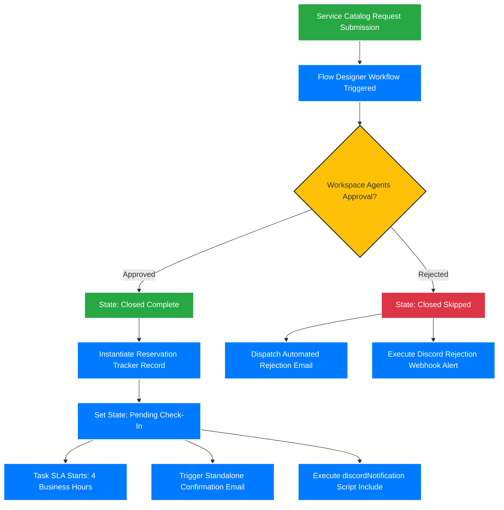

# Workspace Reservation Manager (WRM) 🚀

A custom, multi-table scoped ServiceNow application designed to automate, manage, and track hot desk and focus room reservations from request to closure. Built in an Agile framework using structured Git/GitHub branching and update set tracking.
---
## 📌 Architecture Overview

---
## 🛠️ Phase 1 — Building the Foundation

The objective of Phase 1 was establishing database schemas, access parameters, form behaviors, and front-end catalog intake structures.
### Data Modeling & Architecture
The application utilizes three main tables to govern workspace tracking:
*   **Workspace Options (`x_scoped_wrm_options`):** An inventory database containing all reservable structural assets (hot desks, focus rooms, collaborative spaces) featuring image-loaded asset records.
*   **Reservation Tracker (`x_scoped_wrm_tracker`):** The engine table **extending the OOB baseline Task table**. This layer inherits standard enterprise states and assignment loops. Dictionary label overrides were deployed to change generic labels into contextual metadata (e.g., `Description` renamed to `Purpose of Visit`; `Close Notes` renamed to `Maintenance Issue`).
*   **Workspace Maintenance (`x_scoped_wrm_maintenance`):** A tracker monitoring assets marked broken, out-of-commission, or flagged during inspection workflows.
### User Interface Customization (UI Policies & Actions)
*   **UI Policies:** Enforces strict conditional visibility and immutability. Core variables like `workspace`, `location`, and `requester` switch to read-only post-submission to prevent data tampering.
*   **UI Actions:** Client-interactive form buttons configured directly on the platform runtime environment: `Check In`, `Check Out`, `No-Show`, `Needs Maintenance`, and `Claim`.
### Front-End Self Service (Service Catalog)
*   **Request Workspace Reservation Catalog Item:** The system-wide ingestion form. It features dynamic script filtering to return *only* available workspaces, auto-populates requester context, and captures transactional details (times, locations, additional inputs).
---
## ⚡ Phase 2 — Automating the Process

Phase 2 shifts the scoped application from static structures into a live, multi-channel integrated process.
### Process Automation (Flow Designer)
The architecture routes around the **Workspace Reservation Flow** built in Flow Designer:
1.  Catches the catalog intake item submission.
2.  Dispatches approval tasks to the `Workspace Agents` assignment group.
3.  **Approved Branch:** Triggers custom notification channels, transitions the baseline RITM state to *Closed Complete*, and instantiates a Reservation Tracker entry marked *Pending Check-In*.
4.  **Rejected Branch:** Dispatches rejection notices, drops the RITM state to *Closed Skipped*, and routes an automated mail trace back to the user.
### Custom Server-Side Scripting & Integration
*   **`discordNotification` Script Include:** A reusable, server-side JavaScript module that reads an active Discord incoming webhook URL directly from a ServiceNow System Property (`gs.getProperty()`). This handles programmatic REST payloads to alert agent fulfillment channels inside team chat environments.
### Platform Governance & Security
*   **Access Control Lists (ACLs):** Role-based access configured on all custom application tables:
    *   `wrm_user`: Granted read and create privileges for personal reservation tracks.
    *   `wrm_agent`: Access to write, update, and manage global agent queues.
    *   `wrm_admin`: Holds full control over application layout configurations and destructive `Delete` operations.
*   **SLA Engine Optimization:** Implemented the *Workspace Reservation Fulfillment SLA* referencing standard business operational calendars. Targets a strict **4 business hour** fulfillment threshold. Integrates a cloned SLA escalation engine distributing notification triggers at 50%, 75%, and 100% of elapsed time.
### Automated Bulk Ingestion
*   **Manager Data Updates Catalog Item:** A dedicated manager dashboard enabling multi-row Excel batch uploads. Paired with backend **Import Sets and Transform Maps**, it transforms raw data blocks into the system inventory database asynchronously and sends a fulfillment report upon execution.
---
## 📋 Sprint Deliverables Matrix
### Sprint 1 (Foundations)
- [x] Scoped application architecture configuration with 3 roles (`wrm_user`, `wrm_admin`, `wrm_agent`).
- [x] Contextual update sets mapped to targeted development stories.
- [x] Workspace Options database mapping and image-attached data import.
- [x] Task table extension and custom metadata label overrides.
- [x] Navigation modules secured via role-based access.
- [x] Embedded UI actions (`Check In`, `Check Out`, `No-Show`, `Needs Maintenance`, `Claim`).
- [x] Service Catalog intake item with contextual user-data loading.
### Sprint 2 (Automations & Scripts)
- [x] Catalog Client Scripts enforcing location auto-population and end-date chronologic validation.
- [x] Discord notification Script Include powered by platform System Properties.
- [x] Multi-branch Flow Designer Approval Workflow layout.
- [x] Table-level and field-level Security Access Control Lists (ACLs).
- [x] Standalone event-driven email confirmation notifications.
- [x] Custom Business Hour SLA Engine tracking and Task SLA related lists.
- [x] Post-checkout agent maintenance notification engine.
- [x] Excel data ingestion transform engine for automated bulk workspace loads.
---
## 🛠️ Languages and Tools
*   **Languages:** JavaScript (ES6+), HTML, SQL, XPath.
*   **ServiceNow Native Tools:** ServiceNow Studio, Guided Application Creator, Flow Designer, Automation Test Framework (ATF), REST API Explorer.
*   **SDLC Support:** Git/GitHub Branching, Jira, Update Sets.
